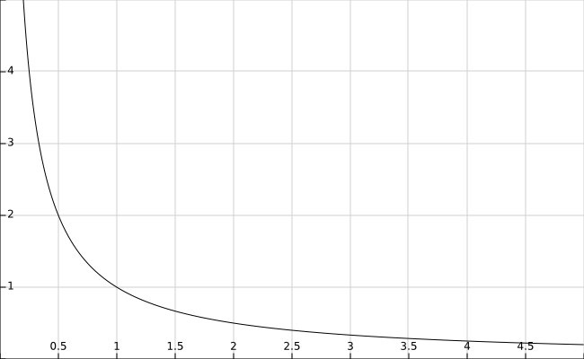
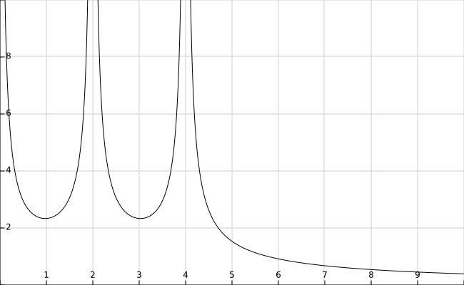
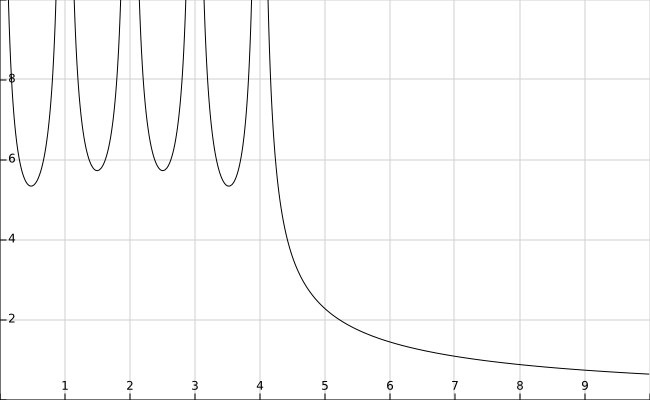
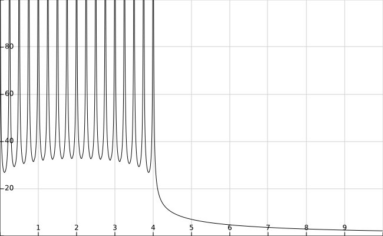
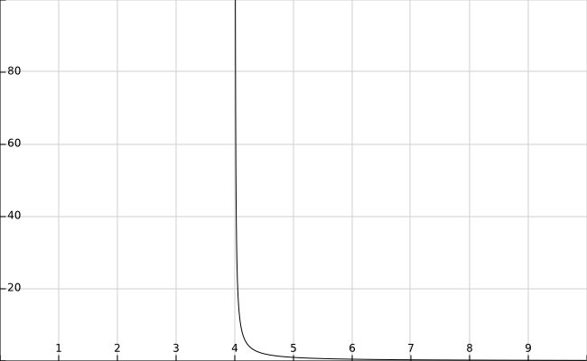
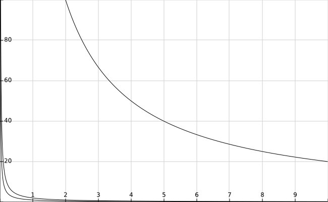

> Эту статью я впервые опубликовал здесь в заметках в феврале 2011 года как результат долгих размышлений и философских бесед. Интересно замечать то, как эти идеи не только не потеряли своей актуальности и по сей день, но и углубились и закрепились в моём образе мысли и действия. Публикую этот немного отредактированный текст в качестве теста нового функционала ВК и способности аудитории моей страницы осилить такие размышления теперь.

Мой отец уже неоднократно поднимал один важный и, как казалось, риторический вопрос: как человек может критиковать какую-то часть окружающей реальности? Как можно выносить суждения о ней, являясь при этом прямым следствием этой самой реальности? Ведь действительно, откуда может взяться суждение о правильности или неправильности того или иного события или мнения, если они, с точки зрения «объективной реальности», этим окрасом не наделены и вообще не делятся ни на какие категории вроде «хорошо» - «плохо», «нужно» - «не нужно»? Иными словами, явления сами по себе не имеют ценности, и лишь субъект делит целостный объективный мир на части, отдельность которых является просто следствием ограниченности его осознания.

Проще говоря, мы делим нейтральный мир на «хорошо» и «плохо» либо потому, что так принято, либо потому, что не видим мир целиком, а воспринимаем его только со своего ракурса, откуда события получается разделить на эти категории руководствуясь эмоциями, ощущениями, предрассудками и общественным мнением.

Однако это утверждение верно лишь для обывателя: для того, кто отказался от стремления познать мир, охватить сознанием объективность, пускай даже эта цель и кажется недостижимой. Для человека, мыслящего рационально, познающего окружающую реальность всесторонне и старающегося отринуть субъективные суждения, существуют возможности преодолеть ограниченность личной точки зрения — это и научный метод, и возможность взглянуть на мир другими глазами через искусство, и практики медитации и просто ясность ума и стремление освободить его от влияния субъективных эмоций и временных душевных состояний.

### Большой вопрос

Мне давно не давал покоя вопрос: вот люди, которые всю жизнь стремятся к объективному, непредвзятому познанию окружающей реальности, исследуют окружающий мир и являются вполне рационально мыслящими инженерами, математиками, физиками — откуда у них возникают в качестве одного из важнейших столпов мысли гуманистические ценности?

Откуда возникает понимание бесценности человеческой жизни, причем абсолютно каждой? Откуда берется эта странная забота и даже какая-то такая «рациональная любовь» к людям? Неужели это все — просто влияние церкви, традиции и воспитания родителей? То есть, неужели человек, прорвавший сотни «слоев» субъективности, сумев приблизиться к объективной картине мира во многих других сферах, не может преодолеть эту субъективную, обусловленную традицией и воспитанием, предвзятость?

Сомнения в этой версии возникают при мысли о том, что воспитание родителей большинство людей преодолевает ещё в пубертатном возрасте и на волне юношеского протеста запросто перепрыгивает через все нравоучения предков и навязанных авторитетов. Да, в этот момент они хватают обрывочные общепринятые ценности, однако очевидно, что «курить — плохо», «учись прилежно», «не завидуй» и прочие простые истины воспитания отвергаются одним махом почти каждым подростком. А народные культурные нормы также легко преодолеваются просмотром ТВ или других носителей культуры других народов. Смешав тысячи каналов, клипов и сериалов в одной голове, мы получаем человека без культурной идентичности и о ценностях, которые старается привить ему окружающее его традиционное общество уже нечего и говорить. На такое отрицание традиции способен каждый, а уж рационально мыслящий и эрудированный человек и подавно.

Таким образом, версия о подспудном влиянии базовой культуры на человека, стремящегося к максимально объективному взгляду на реальность, оказывается несостоятельной. Соответственно корни рационального гуманизма стоит искать в самой рациональности мышления и в стремлении к объективности.

Под словом «гуманизм» мы здесь подразумеваем ясное осознание бесценности жизни каждого человека. Это осознание прав, свобод и стремлений каждого как равно важных. Это нередко выражается в образе жизни самого «гуманиста» с учетом ценностей, включающего некую «рациональную аскетичность» и даже «рациональную любовь» к окружающим. Например, этот подход ярко проявляется у мыслителей и деятелей-социалистов, которые будучи крайними материалистами, приходят к разработке утопий или даже осуществлению революций во имя угнетённых масс, зачастую пренебрегая собственными потребностями и желаниями. Важно и то, что эти мыслители и деятели слишком часто оказываются убежденными атеистами, чтобы исключить предположения об их религиозном догматизме. Но не только среди подобных людей встречается такая убежденность. Она вообще распространена и, наверняка, вы её обнаружите и у себя или у кого-то из своих знакомых.

### Математическая модель

Нам удалось приоткрыть завесу тайны возникновения этого феномена. Приближенную модель формирования такого рационального гуманизма можно описать с помощью бесстрастного языка математики.

Средний человек, о котором мы уже упомянули выше, формирует своё мироощущение и приближенную картину мира исходя из собственных эмоций, ощущений и некоего «общественного мнения» окружающих его людей. «С кем поведешься...»

Нас интересует не вся сложнейшая картина субъективной позиции человека, а лишь один простой параметр: ценность жизни каждого отдельного человека. И, если проследить динамику изменения этого параметра в зависимости от близости этих отдельных людей исследуемому человеку, мы с большой долей вероятности получим вот такой график:

, где y – это ценность жизни, а x – это степень близости человека.

Нетрудно заметить, что это график простейшей функции y=1/x , т. е. график простой обратной зависимости. Чем ближе к нам человек, тем его жизнь ценнее. Этот график точно такой же и для субъективной значимости чувств, желаний и устремлений людей в зависимости от их близости к индивиду.

Действительно, это вполне ясно, что с субъективной точки зрения отдельно взятого человека ценность жизни его ребенка, супруга, друга или родителей куда более высока, чем жизни просто знакомых людей, а их жизни, в свою очередь, куда более ценны, чем жизни простых прохожих или пассажиров метро. Жизни жителей других городов менее ценны, чем соседей, а жители других стран по сравнению с жителями страны собственной уже почти не заметны, что уж говорить о совсем далеких «индейцах» или «китайцах», отделенных не только расстояниями или культурными границами, но еще и внешним видом и генетическими отличиями. Помните про желания и стремления, с ними дело обстоит точно так же.

Каждый обыватель повсюду носит с собой этот график и люди, его окружающие, так или иначе попадают в разные координаты на оси X, перемещаются по ней по мере знакомства или забвения. И, что характерно, в точке 0, а в данном случае в точке «Я» этот график стремится по оси «ценности жизни» к бесконечности.

Математически: lim[x->0](1/x)=∞ .

Действительно, нередко желания и стремления даже самых близких людей меркнут по сравнению с желаниями и стремлениями лично нашего эго в точке «Я».

Также применимость этого графика уже многократно подмечена СМИ, которые четко знают, что смерть одного известного, уже «близкого» зрителю, человека будет воспринята с куда большим вниманием и скорбью, чем 10 жертв автокатастрофы на другом конце страны, а уж про жертв в других странах решаются рассказать, не боясь показаться занудными, только если количество жертв переваливает за несколько десятков, сотен, а то и тысяч человек!

Кто-то скажет, что это нормально. Спорить с этим сложно, конечно. Да никто и не спорит, ведь «норма» - это и есть прямое следствие культуры, традиции и «общественного мнения». Но давайте проследим, что же делать человеку, решившемуся преодолеть эту субъективность и попытаться посмотреть на ценность жизни и на общественную жизнь максимально близко к объективности.

Очевидно, что также, как события и мнения сами по себе не несут никакой окраски по шкале «хорошо» - «плохо» и являются просто некими элементами объективной реальности, которые можно выделить и обособить, рассмотреть и наделить оценкой с той или иной субъективной точки зрения, точно также и понятие ценности жизни человека с абсолютно объективной точки зрения, кажется, теряет смысл, ведь каждый отдельно взятый человек не является носителем этой оценки ценности…

СТОП!

Напротив, является. Мы уже увидели, что каждый человек, вне зависимости от окружающих, от стороннего наблюдателя, является субъективным наблюдателем для самого себя и несет в себе собственную, присущую ему самому ценность его жизни. Это — коренное отличие человека ото всех неодушевленных предметов и явлений.

В соответствии с этим очевидно, что для построения графика объективной ценности жизни людей нужно просто просуммировать их внутренние ценности и построить график суперпозиции всех личных функций для всех.

Случай для трех людей:

y=1/x + [1/(x-2)] + [1/(x-4)]

А вот и пять человек:

y=1/x + [1/(x-1)] + [1/(x-2)] + [1/(x-3)] + [1/(x-4)]

Итак, для выработки ясной картины объективной ценности жизни каждого отдельного человека, нужно просто просуммировать графики абсолютно всех людей. Очевидно, что график для множества людей будет выглядеть уже почти точно также, как и график каждого отдельного человека, только в области бесконечной ценности оказывается не какой-то отдельный субъект, а все люди вместе.

y=1/x + [1/(x-0.5)] + [1/(x-1.5)] + [1/(x-2.5)] + [1/(x-3.5)] + [1/(x-1)] + [1/(x-2)] + [1/(x-3)] + [1/(x-4)] + [1/(x-0.25)] + [1/(x-1.25)] + [1/(x-2.25)] + [1/(x-3.25)] + [1/(x-0.75)] + [1/(x-1.75)] + [1/(x-2.75)] + [1/(x-3.75)]

y=1(x-4)

Таким образом мы получаем эдакий Большой Эгоизм, когда ценность жизни каждого человека устремляется к бесконечности, а вместе с ней и желания и стремления каждого отдельного человека приобретают равновеликую важность. При этом, внешние по отношению к этой области бесконечной ценности явления и существа будут обладать некоей конечной, измеряемой и сравнимой ценностью. Мы склонны считать, что в данном случае график принимает вид биологической или, иными словами, экологической ценности, однако рассмотрение этого момента не входит в задачи данного исследования.

Мы получили некую объективную картину ценности жизни, с позиций которой совершенно очевидна неизмеримая, бесконечная ценность жизни абсолютно каждого человека (а, возможно, и каждого живого существа, об этом стоит поговорить отдельно). Таким образом мы приходим к очевидному выводу, что в тот момент, когда рационально мыслящий человек, пытающийся вырваться из оков субъективности, приходит к этому графику, к осознанию подобных выводов, этот человек становится носителем, причем ясно осознающим себя носителем, того самого рационального гуманизма. Гуманизма, появляющегося из самостоятельного осознания человека, а не из нравоучений родителей, наставлений религиозных учителей или пресловутого «общественного мнения» окружающих. Не умаляя важности и этих источников добродетели, важно отметить, что на рационального, буквально математически мыслящего человека эти институты имеют очень слабое влияние.

### Что с этим делать?

Что ж. Осознание объективной картины — это лишь первый шаг. Ведь вырваться из субъективного восприятия — это практически невозможная задача и по сему объективный взгляд возможен только теоретически. Однако, можно постараться приблизить своё субъективное восприятие к той ясности, что дает нам объективная картина реальности. Для этого можно предположить чисто математические возможности приближения субъективной функции «ценности» от «близости» к картине «объективной ценности».

Выше приведены три «субъективных» графика. Это графики функций y=1/x (самый резкий спад), y=1/(0.5x) (чуть плавнее), y=1/(0.005x) (самый плавный). Очевидно, что, уменьшая коэффициент «а» в функции y=1/(a*x), мы можем охватить все большее «расстояние» от нас, ценить жизнь и устремления все более и более далеких от себя людей, тем самым приближая свой субъективный взгляд к объективной картине, пускай и в приближенном виде. Очевидно, что покуда коэффициент «а» будет иметь некое, пускай и крайне малое значение, важность собственной жизни всегда будет единственной бесконечной величиной в точке «Я», а все остальные жизни будут иметь пускай и значительную, но все же конечную ценность. И только устремлением коэффициента «а» к нулю мы можем получить то, что график резко взмоет ввысь и исчезнет в бесконечности, попутно стирая субъективные различия между людьми.

Так что же это за коэффициент? Мы бы назвали его «коэффициентом эгоизма». При его устремлении к нулю вы все ближе приближаетесь к соответствию своего субъективного суждения и объективной картины, которую пытливый ум сможет осознать без особых усилий.

Конечно же, мы понимаем, что все эти построения — лишь игра ума, и никакая математика не заставит ценить других людей так же как себя и никакие графики не в силах заставить человека бороться с собственным эгоизмом и ограниченностью мышления. Однако эти построения, возможно, могут немного раскрыть механизм возникновения высоких гуманистических идеалов у людей жестко прагматичных и материалистичных. Теоретически, даже робот, обладающий несложным искусственным интеллектом будет способен осознать подобные математические выкладки и тоже стать носителем некоторого своего «искусственного гуманизма» или, с позволения, «роботизма». 

[2011-02-05](https://vk.com/wall129086_6360)